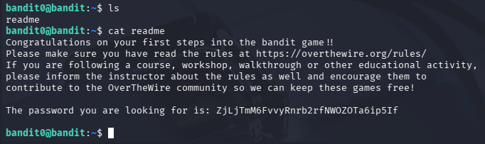

## Opdracht (Level 0 -> 1)
De opdracht van dit level is om een wachtwoord te achterhalen. Met dit wachtwoord 
kan ik vervolgens via SSH inloggen om naar het volgende level te gaan. De enige info
die mij verteld werd in de opdracht is dat het wachtwoord staat in de enige file die 
er te vinden is. 

## Stappen ondernomen
- Ik wilde eerst weten welke file er beschikbaar was. Dit deed ik met "ls"
- File die er stond was "readme"
- Openen van de file door "cat readme" te doen.
- Wachtwoord stond hier toen in.

## Commands die ik heb gebruikt
- ls
- cat

## Screenshot

## Wat ik heb geleerd
- Zien welke files er allemaal aanwezig zijn
- Files bekijken doormiddel van de cat commando

## Skills die ik heb geoefend
- Commando's "cat" en "ls"
