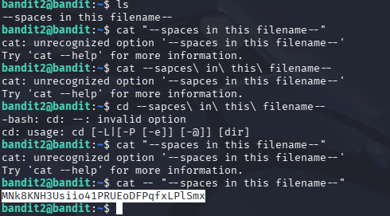

## Opdracht (Level 2 -> 3)
De eerste opdracht is om in te loggen in het spel door gebruik te maken van SSH.
In dit level moest ik het wachtwoord uit een bestand met spaties halen. Dit wachtwoord
kan ik dan vervolgens gebruiken om door te gaan naar het volgende level.

## Stappen ondernomen
- Ik probeerde eerst de file te openen door gewoon het bestand tussen "" te zetten.
  Hierbij kreeg ik gelijk een foutmelding dat "cat" de optie niet herkende.
- Op google gezocht hoe je files met spaties opent.
- Geprobeerd om de file te openen doormiddel van backspaces te gebruiken.
  Dit werkte helaas ook niet en kreeg direct dezelfde error.
- De error opgezocht op google en gezocht naar een oplossing
- De eerste optie die ik aan het begin had gebruikt nog een keer gebruikt maar
  nu met -- ervoor.
- Nu kreeg ik de inhoud van de file te zien met het wachtwoord.

## Commands die ik heb gebruikt
Verkeerde commando's
- cat "--spaces in this filename--"
- cat --spaces\ in\ this\ filename--

De command die uiteindelijk juist was:
- cat -- "--spaces in this filename--"

## Screenshot

## Wat ik heb geleerd
Ik heb geleerd wanneer je files aanmaakt met spaties erin, de terminal 
denkt dat dit opties zijn voor een command. Wanneer je deze file dus 
zomaar probeert te openen krijg je direct een error dat de opties van de
command niet geldig zijn. Een manier om dit op te lossen is door "--" voor
het bestand neer te zetten. Dit betekend eigenlijk dat je laat weten dat er geen
opties meer hierna komen. Wat er achter de "--" staat behandelt linux dus niet meer
als optie.

## Skills die ik heb geoefend
Ik heb geoefend met verschillende manieren hoe je files met spaties erin kan openen. 

