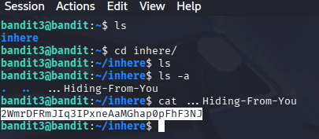

## Opdracht (Level 3 -> 4)
In dat level stond er in een verborgen map het wachtwoord voor het volgende level.
Mijn taak was om de verborgen file te vinden en deze vervolgens te openen voor het wachtwoord.

## Stappen ondernomen
- ls gebruiken op te zien welke folders er waren
- Gaan naar de juiste folder waar verborgen file in zou staan
- Kijken om welke file het gaat door ls -a te doen.
- Zodra file naam gevonden, file openen met cat [filename]

## Commands die ik heb gebruikt
- ls -a
- cd
- cat [filename]

## Screenshot

## Wat ik heb geleerd
Ik heb dit level niks nieuws geleerd, want ik wist al dat je verborgen files 
kon vinden met de '-a' optie. 

## Skills die ik heb geoefend
- cd
- ls -a gebruiken om verborgen files te vinden

