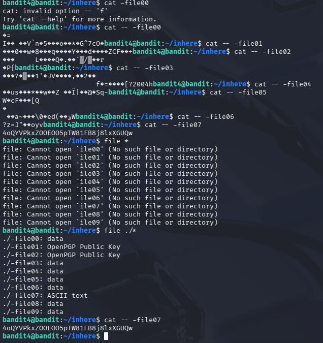

## Opdracht (Level 4 -> 5)
Voor deze opdracht was er een folder met verschillende files erin.
1 van deze files bevatte normale "human-readable" tekst en de rest 
bevatte allemaal andere tekens. Het doel was om de file te vinden die het
wachtwoord bevatte. 

## Stappen ondernomen
- Eerst probeerde ik de eerste file te openen door "cat -file00" te doen. Dit werkte niet.
- Hierna probeerde ik de file te openen door "cat -- -file00" te doen. Dit werkte wel.
- Toen probeerde ik dit bij elke file te doen. Dit werkte wel, maar dit zorgde voor
  veel herhaling en dat is niet efficiënt.
- Ik deed hierna "file *" om te zien wat alle files bevatte kwa inhoud. Dit werkte ook
  niet, omdat die nu files zag als "ile00" inplaats van "-file00".
- Toen ik "file ./*" deed werkte die wel en zag van elke file wat voor soort inhoud erin stond.
- Ik zag dat file07 ASCII text bevatte als enige dus wist dat dit de file moest zijn.
- Toen "cat -- -file07" gedaan en toen had ik het wachtwoord succesvol ontvangen

## Commands die ik heb gebruikt
Niet werkende:
- cat -file00
- file *

Wel werkende:
- find ./*
- cat -- -file07"

## Screenshot

## Wat ik heb geleerd
Ik heb geleerd bij dit level dat je doormiddel van de command "find" kan achterhalen
wat voor soort data een file bevat. Hierdoor kan je gelijk zien of er relevante data in zit. 
Ik merkte al toen ik de opdracht aan het maken was dat ik het vervelend vond om elke file 
1 voor 1 af te gaan om te kijken wat voor inhoud erbij zat. Met de file optie kon ik in 1x zien 
bij welke file ik moest zijn. Achteraf had ik het nog sneller kunnen doen door "file ./* | grep ASCII" 
te doen. Hierna zoekt die gelijk naar de file waar er gebruik wordt gemaakt van ascii.

## Skills die ik heb geoefend
- Ik heb geoefend om doormiddel van de file optie te zoeken naar file data. Hierdoor is het
  eenvoudiger om te vinden waar je naar zoekt. 

