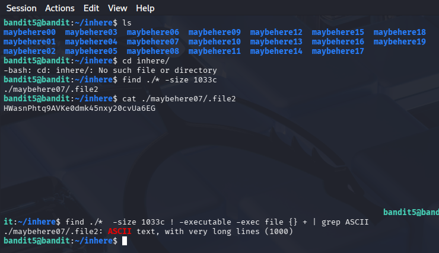

## Opdracht (Level 5 -> 6)
In dit level zou er ook een file zitten voor het wachtwoord naar het volgende level.
Echter nu moest het aan de volgende criteria voldoen:
- human-readable
- 1033 bytes in size
- not executable

## Stappen ondernomen
- Openen van de Inhere folder door cat inhere te doen
- ls gedaan om te kijken welke files er allemaal in zaten
- Ik zag dat er veel folders met verschillede files inzaten
dus wilde niet zoals de vorige opdracht door elke file heen 
hoeven te gaan.
- Ik deed wilde eerst weten welke files 1033 bytes waren dus 
voerde find ./* -size 1033c uit.
- Toen kreeg ik al gelijk de file welke het zou zijn, maar dit 
vond ik zelf niet goed genoeg omdat ik nu maar 1 van de 3 criteria 
gebruikt had.
- Ik ben gaan zoeken naar hoe je filtert op "not executable" op google.
- Size en Human-readable wist ik al dus heb ze gecombineerd tot het volgende:
"size 1033c ! -executable -exec file {} + | grep ASCII" en toen kreeg ik 
ook het goede wachtwoord voor het volgende level.

## Commands die ik heb gebruikt
- ls
- cd inhere/
- find ./* -size 1033c
- cat ./maybehere/.file2
- find ./* -size 1033c ! -executable -exec file {} + | grep ASCII

## Screenshot

## Wat ik heb geleerd
Ik heb geleerd hoe je kan filteren op files die verschillende criteria hebben. 
Verder heb ik geleerd hoe je kan filteren op "size" en op files die "not executable" zijn.

## Skills die ik heb geoefend
- Filteren binnen folders en files
